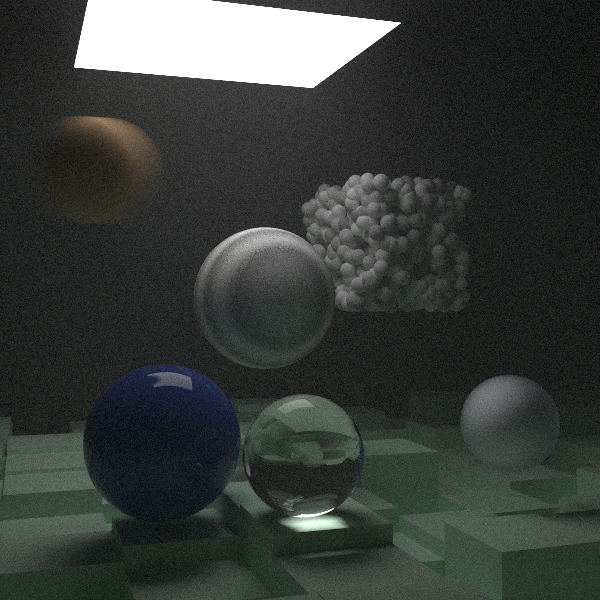
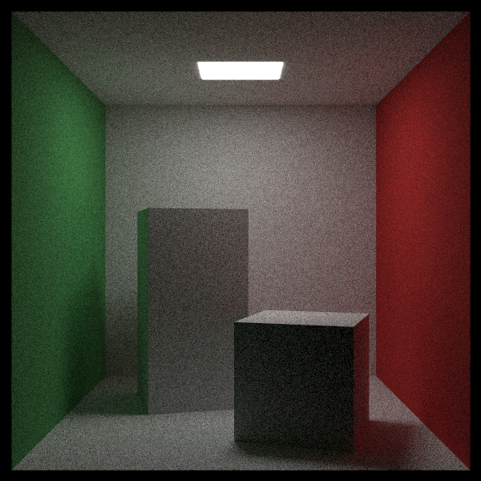

# Ray Trace 2

This is my second iteration of a CPU-based ray tracer following the book series [Ray Tracing in One Weekend](https://raytracing.github.io/) by Peter Shirley.
I generally followed the books but included extra features including a live view into the render via OpenGL, a scene data format in JSON
to author scenes without recompilation, parallel execution, and a scene graph.

## Building Locally

Currently, OpenGL 4.6 is required to run locally, eliminating the MacOS platform.

```bash
mkdir build && cd build
cmake .. -DCMAKE_BUILD_TYPE=Release
cmake --build .
./src/raytrace_2 <json_scene_name>
# OR to run the default scene
cd ..
python make_scene.py
```

## Implemented Features

- Spheres, quads, and boxes
- Lambertians, metals, dielectrics, constant medium volumes, and procedural textures
- Depth of field and positionable camera
- Bounding volume hierarchy
- (Basic) motion blur
- Lights
- Scene graph/transformations




## Dependencies

- [GLEW](https://github.com/nigels-com/glew) - OpenGL functions
- [GLM](https://github.com/g-truc/glm) - Vector math
- [SDL2](https://github.com/libsdl-org/SDL) - Window
- [Nlohmann JSON](https://github.com/nlohmann/json) - Scene serialization
- [ImGui](https://github.com/ocornut/imgui) - UI
